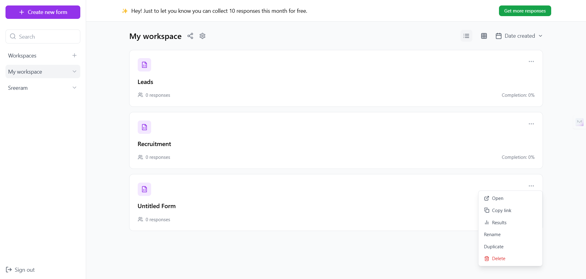
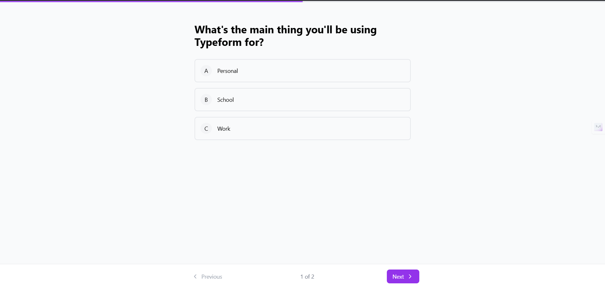
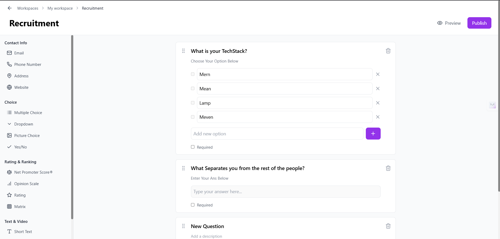
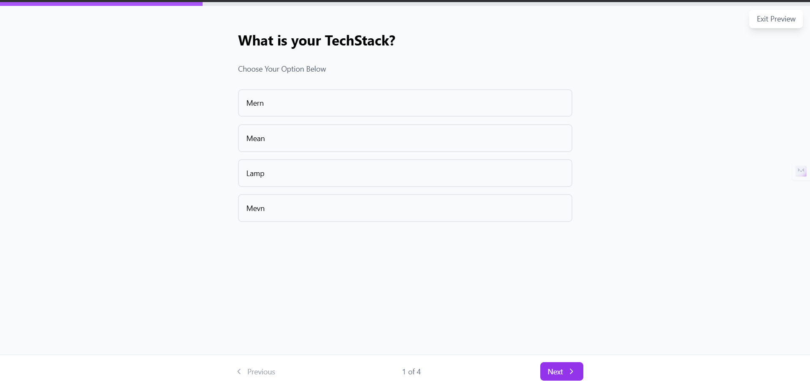

# FormFlow

## 📌 Overview
FormFlow is a powerful and intuitive form creation platform that allows users to create interactive forms and surveys with ease. Built with modern web technologies to provide a seamless form-building experience.

## 📸 Project Screenshots

### Workspace Interface


### Form Builder


## 🌟 Features

### User Authentication


* **Multiple Sign-in Options**
  * Google Sign-in integration
  * Microsoft Sign-in integration
  * Email/Password authentication
  * Secure user workspaces

### Form Building Capabilities
* **Diverse Question Types**
  * Choice (Single/Multiple)
  * Dropdown menus
  * Picture choice
  * Yes/No questions
  * Rating & Ranking systems
  * Net Promoter Score®
  * Opinion Scale
  * Matrix questions
  * Text inputs (Short/Long)
  * Video integration

### Workspace Management
* **Organization Features**
  * Create multiple workspaces
  * Organize forms by purpose (Personal/School/Work)
  * Track response metrics
  * Form completion statistics

## 💡 Use Cases
* **Business**
  * Recruitment and HR processes
  * Customer feedback collection
  * Professional research
* **Education**
  * Educational surveys
  * Student feedback forms
* **Personal**
  * Personal data gathering
  * Event registration

## 🚀 Getting Started
1. Visit the FormFlow platform
2. Sign up using your preferred authentication method
3. Create your first workspace
4. Start building forms with our intuitive interface

## 📸 Project Screenshots

### User Journey
<table>
  <tr>
    <td>
      <p align="center"><strong>Login & Signup</strong></p>
      
    </td>
    <td>
      <p align="center"><strong>Onboarding</strong></p>
      
    </td>
  </tr>
  <tr>
    <td>
      <p align="center"><strong>Workspace</strong></p>
      
    </td>
    <td>
      <p align="center"><strong>Form Builder</strong></p>
      
    </td>
  </tr>
  <tr>
    <td>
      <p align="center"><strong>Form Preview</strong></p>
      
    </td>
    <td>
      <p align="center"><strong>Form Publishing</strong></p>
      
    </td>
  </tr>
</table>

## 📝 License
This project is licensed under the MIT License - see below for details:

```
MIT License

Copyright (c) 2024 [Your Name]

Permission is hereby granted, free of charge, to any person obtaining a copy
of this software and associated documentation files (the "Software"), to deal
in the Software without restriction, including without limitation the rights
to use, copy, modify, merge, publish, distribute, sublicense, and/or sell
copies of the Software, and to permit persons to whom the Software is
furnished to do so, subject to the following conditions:

The above copyright notice and this permission notice shall be included in all
copies or substantial portions of the Software.

THE SOFTWARE IS PROVIDED "AS IS", WITHOUT WARRANTY OF ANY KIND, EXPRESS OR
IMPLIED, INCLUDING BUT NOT LIMITED TO THE WARRANTIES OF MERCHANTABILITY,
FITNESS FOR A PARTICULAR PURPOSE AND NONINFRINGEMENT. IN NO EVENT SHALL THE
AUTHORS OR COPYRIGHT HOLDERS BE LIABLE FOR ANY CLAIM, DAMAGES OR OTHER
LIABILITY, WHETHER IN AN ACTION OF CONTRACT, TORT OR OTHERWISE, ARISING FROM,
OUT OF OR IN CONNECTION WITH THE SOFTWARE OR THE USE OR OTHER DEALINGS IN THE
SOFTWARE.
```

---
*FormFlow - Create interactive forms and surveys with ease.*
